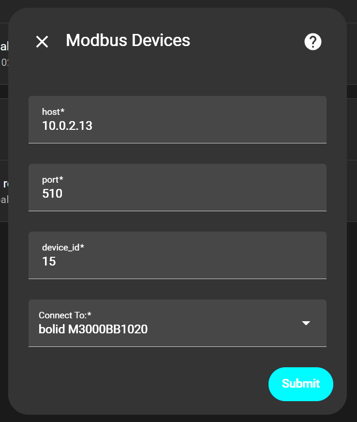
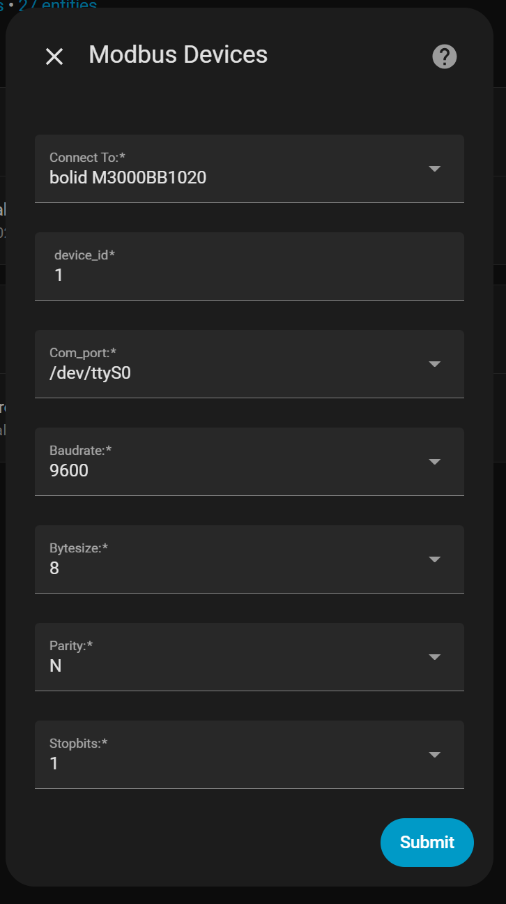
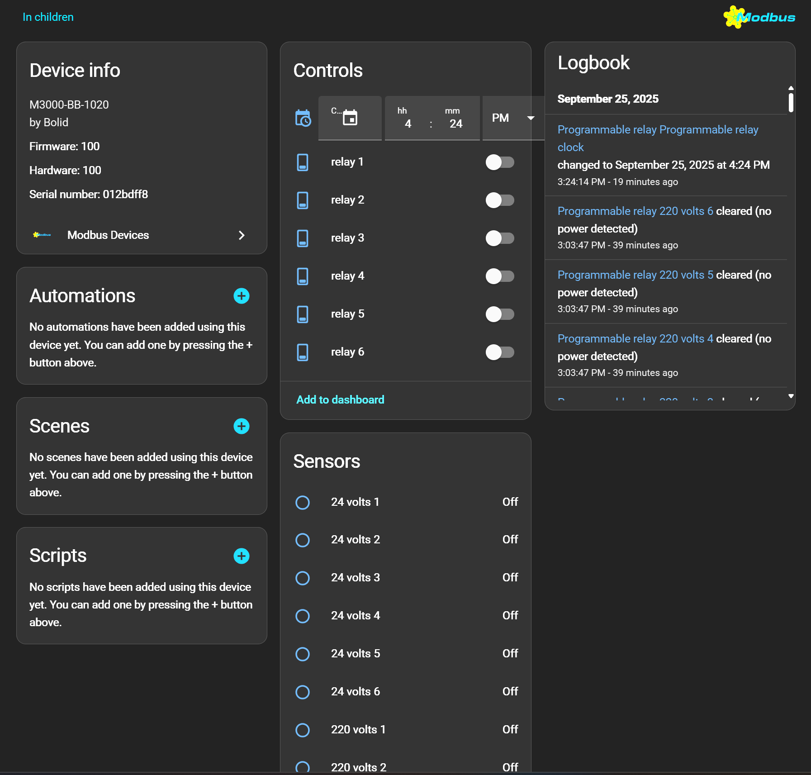
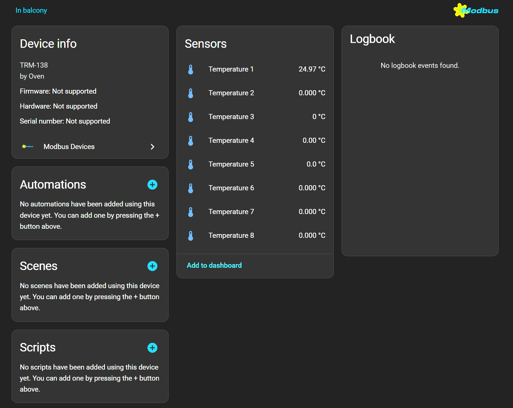
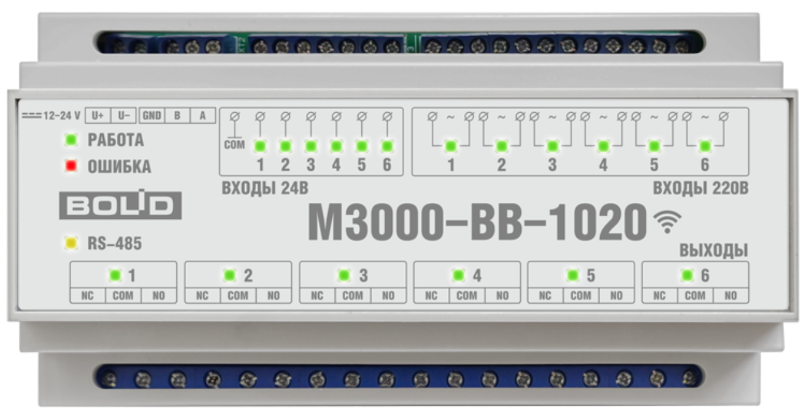
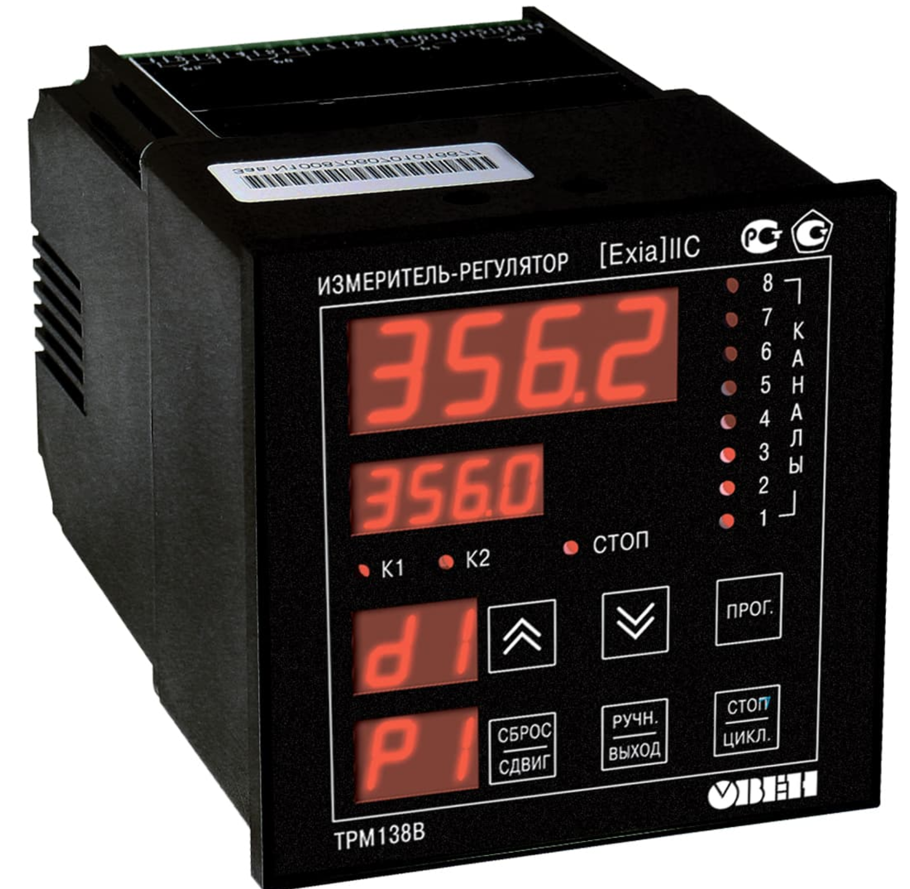

# Modbus Devices для Home Assistant

Компонент интеграции Home Assistant ориентированный на современные отечественные, и импортные промышленные контроллеры, поддерживающие протокол Modbus.

Данный компонент является хабом для устройств с  инетрфейсом **RS485** и протоколом **Modbus/TCP**, **Modbus/UDP**,  так же для прямого подключения **Modbus** через преобразователь **Serial Port**, который поддерживается большинством промышленных контроллеров.

    
    
    

Основная идея компонента заключается в логическом разграничении основной части кода программной логики и построения файлов с классами устройств, в которых каждое устройство представляет из себя отдельный класс.

**Например:**

    Для контроллера M3000-ВВ-1020 компании Bolid создан файл bolid.py в папке equipment, а класс носит название одноимённое с названием модели контроллера: class M3000BB1020:, а для контроллера температуры ТРМ-138 компании Oven файл называется oven.py, а класс class TRM138: и так далее.

Такой подход позволяет интегрировать совершенно различные по функционалу устройства в умный дом Home Assistant далее HA используя одни и те же платформы, не затрагивая логику работы основной части программы с возможностью при подключении других разработчиков сообщества создать большую базу устройств, которые будут доступны после установки компонента.
Программа написана в базовом варианте и будет усовершенствована по мере дальнейшей работы над проектом. Как логика работы программы компонента, так и увеличение устройств в безе данных по количеству и фирмам производителям.

## Поддерживается:

- Полное автоматическое формирование виртуального эквивалента выбранного из списка устройства
- Полное автоматическое создание всех его платформ и сущностей с необходимым функционалом присущим выбранному компоненту.

## Например:

    
    
    
    

## Установка

**Способ 1.** [HACS](https://hacs.xyz/)
> HACS > Интеграции > 3 точки (правый верхний угол) > Пользовательские репозитории > URL: http://HACS_REPO, Категория: Интеграция > Добавить > подождать > Modbus Devices > Установить

**Способ 2.** Вручную скопируйте папку **modbus_devices** из [latest_release](https://github.com/dk-1983/modbus_devices/releases/tag/latest) в директорию /config/custom_components.

## Ссылки на поддерживаемые приборы

- [Bolid M3000-BB-1020](https://bolid.ru/production/disp/inout-modules/m3000_vv_1020.html)
- [Oven TRM-138](https://owen-ufa.ru/shop/proizvoditeli/owen/trm138v-izmeritel-regulyator-8-kanalnyj/?ybaip=1&yclid=14875081144885575679)

## Использованные технологии

- [Pymodbus](https://pymodbus.readthedocs.io/en/stable/index.html) версии 10.0.0 и выше...;

## Информация об авторе

- [Криволап Дмитрий Александрович](https://4vrs.online) Разработчик
